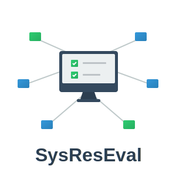

<p align="right">
  <a href="README.md">English</a> · <strong>Français</strong>
</p>

<p align="center">
  
</p>

<h1 align="center">SysResEval (SRE)</h1>

<p align="center">
  <a href="https://sysreseval.github.io/sysreseval/html/main/index.html">Documentation principale (HTML)</a> ·
  <a href="https://sysreseval.github.io/sysreseval/html/api/index.html">Référence de l'API</a> ·
  <a href="docs/documentation.pdf">Manuel PDF</a>
</p>

---

**SysResEval** (*Système Réseaux Évaluation* ou **SRE**) est une suite logicielle open-source pour gérer les séances de TPs et les évaluations dans les cours d'administration réseaux et systèmes.
Chaque « lab » ou projet est un petit réseau virtuel de machines Linux, orchestré via le [framework Kathara](https://github.com/KatharaFramework/Kathara) au-dessus de Docker et VDE.
Les étudiants suivent des exercices guidés dans une interface graphique ;
les enseignants supervisent les séances et organisent des examens à durée limitée avec une notation automatique et reproductible.

Il a été développé à l'**IUT d'Orsay, Université Paris-Saclay**. 

## Fonctionnalités

- **Interface à deux niveaux.** Une interface graphique (`sysreseval`) pour les étudiants, ainsi qu'une CLI complète (`sre`) pour les enseignants. 
L'interface graphique délègue à la CLI via un petit utilitaire setuid `sre-wrapper`, ce qui maintient une séparation claire des privilèges.
- **Structure de projet riche.** Chaque projet présente plusieurs onglets :
  - **Schéma** — le schéma du réseau (certaines machines peuvent interdire la connexion — affichées généralement en rouge — ou être cachées ;
  - **Informations** — le contexte général et les consignes, rédigés en Markdown ;
  - **Questions** — Une liste d'items que l'étudiant doit traiter. Chaque question est :
    - soit un texte Markdown décrivant une tâche à effectuer sur les machines (par ex. *configurer le réseau sur m1*),
    - soit un formulaire dont les champs capturent des faits précis (par ex. *quel est le MTU de `eth0` sur m1 ?*) ; les champs peuvent être du texte libre validé par une regex (par ex. une adresse IPv4), une liste déroulante ou une case à cocher,
    - soit une réponse libre multi-lignes.
  - **Terminaux** — un terminal pour chaque machine à laquelle l'étudiant a le droit de se connecter. Ce peut être de simples shells root ou
par exemple une invite `login` qui restreint l'étudiant à un compte utilisateur particulier.
  - **Machines** — un tableau d'état pour chaque machine : état, réseau NAT, ports exposés. Les étudiants peuvent l'utiliser
pour ouvrir des terminaux supplémentaires vers une machine (utile lorsque plusieurs sessions sont nécessaires sur une même machine).
  - **Évaluations** — permet à l'étudiant de déclencher une évaluation automatique de son travail et de visualiser le tableau des notes obtenues.
  - **Appliquer une configuration** — permet à l'étudiant de placer le projet dans un état prédéfini, par exemple une correction partielle.
- **Plusieurs projets ouverts simultanément.** Le contenu d'un cours peut être organisé par thème plutôt que par séance — les étudiants peuvent garder plusieurs projets ouverts et basculer entre eux.
- **Supervision en direct.** `sre watch` est un tableau de bord qui permet à l'enseignant d'obtenir la dernière évaluation de chaque étudiant et affiche les min/max/moyennes par item pour la classe.
- **Examens à durée limitée.** `sysreseval` démarre le projet de chaque étudiant (immédiatement ou à une heure programmée), 
affiche un compte à rebours, lance des évaluations périodiques et affiche une bannière de fin d'examen. 
La durée peut être ajustée à la volée — utile pour les étudiants disposant d'un aménagement.
- **Notation reproductible et traitement post-examen.** Chaque évaluation est archivée sous forme de fichier msgpack compressé contenant les données du projet, les sorties des commandes envoyées sur les machines, les réponses de l'étudiant et les notes par item, consultables avec `sre cat`. Si un bug de notation apparaît après coup, `sre re-eval` permet de 
re-corriger avec un script mis à jour ; `sre outline` produit alors des rapports PDF par étudiant ainsi qu'un tableur ODS récapitulatif. Pendant les examens, chaque session de terminal est aussi enregistrée (format `asciinema`).
- **Internationalisation.** Les chaînes des TP et les traductions de l'interface graphique sont livrées en français et en anglais ; 
les outils fournis (`prepare-sre-translations`, `add-sre-translations`) permettent de traduire facilement un projet.


## Exemple

<p align="center">
  
</p>
<p align="center">
  <a href="docs/demo1.mp4?raw=1">Télécharger la vidéo en pleine qualité (MP4)</a>
</p>


## Installation

SRE est disponible sous Linux (Debian/Ubuntu, toute autre distribution avec une installation manuelle des dépendances).
Les déploiements en production se trouvent sous `/opt/sre` et sont typiquement partagés à toute une salle de classe via NFS.

```bash
git clone https://github.com/sysreseval/sysreseval /opt/sre
cd /opt/sre
sudo ./scripts/install.sh        # interactif — ~10 questions
```

L'installateur crée l'utilisateur système `sre`, dépose une règle sudoers, compile le wrapper C, crée l'environnement `venv` Python, 
et installe (en option) une entrée `.desktop`, la complétion bash, ainsi qu'une unité systemd `sre-preload-images.service`.

Voir **[docs/sphinx/installation.md](docs/sphinx/installation.md)** pour la configuration post-installation :
- relever les limites inotify,
- restreindre l'accès des étudiants à Docker pendant les examens,
- partager les répertoires d'archives pour la supervision en direct,
- pré-télécharger les images Docker pour éviter une saturation réseau au démarrage d'un examen.

L'installation pas à pas, l'installation manuelle et les étapes post-installation sont entièrement documentées dans **[docs/sphinx/installation.md](docs/sphinx/installation.md)**.


## Documentation

- [Aperçu](https://sysreseval.github.io/sysreseval/html/main/overview.html)
- [Installation & déploiement](https://sysreseval.github.io/sysreseval/html/main/installation.html)
- [Faire passer un examen](https://sysreseval.github.io/sysreseval/html/main/exam.html) · [référence examen](https://sysreseval.github.io/sysreseval/html/main/exam-reference.html)
- [Écrire des TP](https://sysreseval.github.io/sysreseval/html/main/lab-authoring.html) · [traductions](https://sysreseval.github.io/sysreseval/html/main/translations.html)
- [Référence CLI](https://sysreseval.github.io/sysreseval/html/main/cli.html) · [Référence GUI](https://sysreseval.github.io/sysreseval/html/main/gui.html)
- [Runtime & internes](https://sysreseval.github.io/sysreseval/html/main/internals.html)

